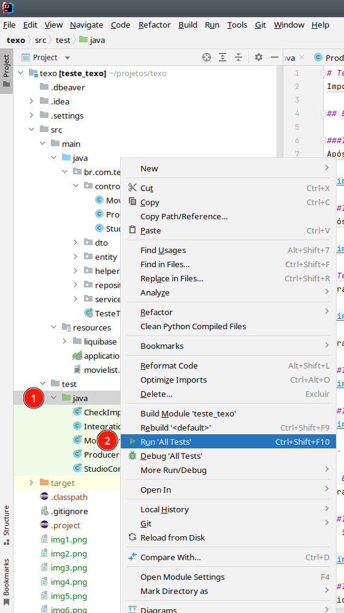
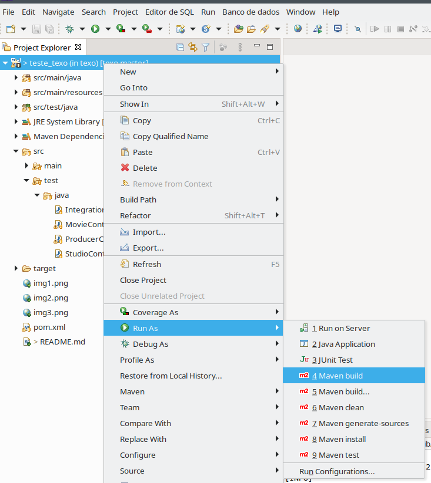

# Teste TEXO IT

Importação de arquivo CSV para um banco de dados H2 e implementação de API REST para leitura dos dados.

## 1. Executar testes de integração automatizados

### 1.1 IDE IntelliJ

Após abrir projeto, clique com o botão direito do mouse no direito no diretório src/test/java para abrir o menu de contexto, localize e clique na opção Run 'All Tests'. A IDE irá executar todos os testes automatizados da aplicação.

### 1.2 IDE Eclipse

Após abrir projeto, clique com o botão direito do mouse no direito no diretório src/test/java para abrir o menu de contexto, localize a opção "Run As", sub-item "JUnit Test".

---

## 2. Testar inclusão dos dados

Para assegurar que os dados fornecidos estão sendo importados corretamente para o banco de dados, a classe de teste CheckImportCSVIntoDatabaseTest foi implementada para verificar a existências dos filmes, produtores e estudios do arquivo CSV localizando-os por título ou nome.

Para executar os testes da classe CheckImportCSVIntoDatabaseTest:

### 2.1 IDE IntelliJ

### 2.2 IDE Eclipse

---

## 3. Executar aplicação pelo terminal

Para executar a aplicação via terminal, primeiro é necessário gerar o .jar da aplicação.

### 3.1 IDE IntelliJ

Na interface do plugin do Maven, selecione os Lifecycles clean, compile e package (mantendo pressionada a tecla Ctrl) e então clique no botão Run acima, conforme a imagem.

### 3.2 IDE Eclipse

Clique com o botão direito do mouse na raiz do projeto para abrir o menu de contexto. Selecione o item "Run As" e o sub-item "Maven build". 

Ao abrir a janela de configuração, digite "package" no campo "Goal" e clique no botão "Run", conforme a imagem.

### 3.3 Linha de comando:

Após gerar o .jar da aplicação, abra o terminal no diretório target do projeto e execute o comando abaixo para inciar a aplicação:

    java -jar teste_texo-1.0-SNAPSHOT.jar

### 3.4 Linux

No linux, com a aplicação em execução, abra um novo terminal e utilize o comando "curl" para invocar os serviços da aplicação que deverá responder na porta 8080:

    curl -i localhost:8080/movies/
    curl -i localhost:8080/movies/title?filter=Armageddon
    curl -i localhost:8080/movies/10
    curl -i localhost:8080/movies/winners

    curl -i localhost:8080/producers/
    curl -i localhost:8080/producers/3
    curl -i localhost:8080/producers/name?filter=Allan%20Carr
    curl -i localhost:8080/producers/winners

    curl -i localhost:8080/studios/
    curl -i localhost:8080/studios/8
    curl -i localhost:8080/studios/name?filter=Paramount%20Pictures
    curl -i localhost:8080/studios/winners

### 3.5 Windows

No Windows, pode ser utilizado o Postman para executar as URL dos serviços conforme exemplo:

--- 

## 4. Requisito da API:

Obter o produtor com maior intervalo entre dois prêmios consecutivos, e o que obteve dois prêmios mais rápido.

### 4.1 Teste automatizado

Este requisito pode ser observado executando-se teste automatizado ProducerControllerTest.winInterval(), o resultado será exibido no terminal:

### 4.2 Linha de comando no Linux

    curl -i localhost:8080/producers/winners/interval; echo

O comando acima deverá retornar os seguintes dados:    

    {
        "min":[
            {
                "producer":"Joel Silver",
                "interval":1,
                "previousWin":1990,
                "followingWin":1991
            }
        ],
        "max":[
            {
                "producer":"Matthew Vaughn",
                "interval":13,
                "previousWin":2002,
                "followingWin":2015
            }
        ]
    }

### 4.3 Postman no Windows

Utilizando o Postman.

